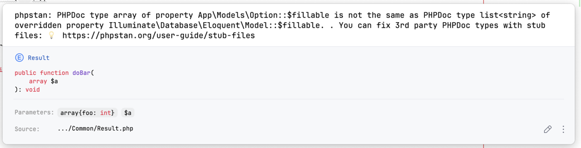
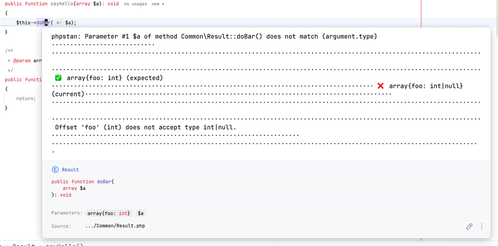
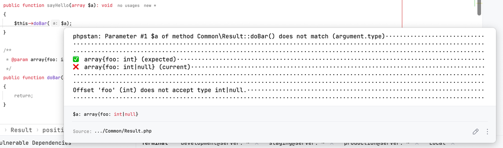

# More Readable PHPStan Output

## Important

This is a proof of concept. Things are rough, hacky and not cleaned up. However, it works.

## Installation

```shell
$ composer require --dev nicksdot/phpstan-prettier-output
```

**Setup Formatters**

```diff
services:
+	errorFormatter.customTable:
+		class: NickSdot\PrettierStanOutput\CustomTableFormatter
+	errorFormatter.customJson:
+		class: NickSdot\PrettierStanOutput\CustomJsonFormatter
+	errorFormatter.customCheckstyle:
+		class: NickSdot\PrettierStanOutput\CustomCheckstyleFormatter
```

**IDE Output**

If you also want prettier messages in your IDE you must override the default `CheckstyleErrorFormatter`. To do this, 
override the service in your `phpstan.non`.

```diff
services:
	errorFormatter.customTable:
		class: NickSdot\PrettierStanOutput\CustomTableFormatter
	errorFormatter.customJson:
		class: NickSdot\PrettierStanOutput\CustomJsonFormatter
	errorFormatter.customCheckstyle:
		class: NickSdot\PrettierStanOutput\CustomCheckstyleFormatter
+	errorFormatter.checkstyle:
+		class: NickSdot\PrettierStanOutput\CustomCheckstyleFormatter
```

## Wishlist

To make this package less hacky, we would need the following.

**PHPStorm PHPStan Plugin**
- allow custom formatter in settings
- allow line breaks in tooltip output.
- adjust processing and consumption of `PhpStanMessageProcessor`.java so that inspection tooltips and inspection the 
  inspections message window use different messages. Similar to how it already works in the HTML inspection.

Plugin repo: https://github.com/JetBrains/phpstorm-phpstan-plugin

**PHPStan**

Currently, we rely on Regex to re-format the reported messages (e.g. adding line-breaks). It would be nice, but it is 
no deal-breaker if not, if PHPStan would add support for formatted messages.

Possible approaches:
- keep track of all non `sprintf`'ed messages in a static property (?) of `RuleErrorBuilder::message()`.
- make it a first class feature to have a formatted and unformatted variant of messages.
- add values required to build messages to `PHPStan\Command\AnalysisResult`.

## Considerations

**Usage of "Tips"**

Ondrej [recommended the sole usage of "tips" output](https://github.com/phpstan/phpstan/discussions/11476#discussioncomment-10274315). However, this seems  not sufficient for the following reasons.

- More often than not there are no "tips".
- There can be multiple tips per error.
- They are often simply external references like in the following example.

```
12   app/Models/Option.php:12                                                      
PHPDoc type array of property App\Models\Option::$fillable is not the same as PHPDoc type list<string> of overridden property Illuminate\Database\Eloquent\Model::$fillable.                                                                                 

💡 You can fix 3rd party PHPDoc types with stub files:               
💡 https://phpstan.org/user-guide/stub-files    
```

Given this example, the solution proposed by Ondrej would result in the following which is not much more readable
and has the same cognitive load than before.



Using the approach from this repository, the output will result in.

```
12   app/Models/Option.php:12 
PHPDoc type of property App\Models\Option::$fillable is not the same as PHPDoc type of overridden property Illuminate\Database\Eloquent\Model::$fillable. 

⁉️ array
⁉️ list<string>

💡 You can fix 3rd party PHPDoc types with stub files:               
💡 https://phpstan.org/user-guide/stub-files    
```

So the current conclusion is, tips are **not** the way.

## Known Issues

For some reason there are sometimes formatting issues based on the cursor postion. This would be avoidable if 
Jetbrains would allow line breaks as listed in the "Wishlist" section in this README.

**Actual**


**Expected**



## Credits

All formatters are based on the [PHPStan built-in ErrorFormatters](https://phpstan.org/user-guide/output-format).

## Contributing

- [Issue Tracker](https://github.com/NickSdot/phpstan-prettier-output/issues)
- [Merge Request ](https://github.com/NickSdot/phpstan-prettier-output/pull)

## License

MIT
